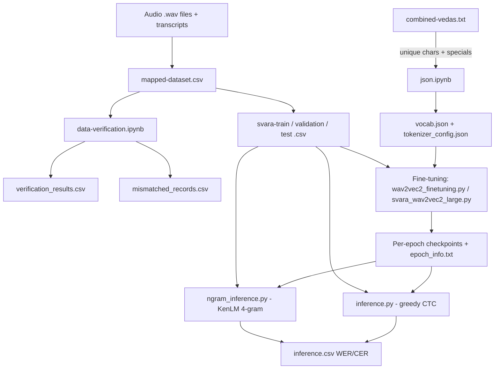

# Vedvani: An End-to-End Speech-to-Text System for Vedic Sanskrit Based on HuBERT/Wav2Vec2 Architectures — A Technical Report

## Abstract

Automatic speech recognition (ASR) for Vedic Sanskrit is challenging because of the language's
archaic phonology, the presence of special diacritics and accent markers (svara), and the scarcity
of curated, machine-readable audio–text corpora. This report documents **Vedvani** (repository
`sanskrit-asr-system`), an end-to-end research prototype that assembles a Vedic Sanskrit dataset and
fine-tunes self-supervised speech models for transcript generation. The repository contains (i) a raw
Vedic transcript corpus (`combined-vedas.txt`) of roughly 30,785 verse lines, (ii) a character-level
tokenizer vocabulary of 74 tokens built directly from that corpus (`vocab.json`,
`tokenizer_config.json`) that **enlarges the pre-trained model's output vocabulary** (64 tokens in
`config.json`) so that Vedic swara accent characters absent from the base model could be recognized,
(iii) a dataset-mapping and verification pipeline that cross-checks
`svara-train.csv` against `mapped-dataset.csv` and emits `verification_results.csv` and
`mismatched_records.csv`, and (iv) two fine-tuning scripts (`wav2vec2_finetuning.py`,
`svara_wav2vec2_large.py`) that train `HubertForCTC` models with a custom PyTorch loop (AdamW,
linear schedule, FP16 gradient scaling, gradient checkpointing), plus three inference/evaluation
paths: greedy decoding (`inference.py`), KenLM 4-gram language-model decoding (`ngram_inference.py`),
and a Hindi XLSR baseline (`svara-inference.py`). Word-error and character-error rates are computed
with Hugging Face `evaluate`/`datasets` metrics. The system is intended for researchers working on
low-resource liturgical-language ASR. Main limitations: hard-coded Linux cluster paths, a single
commit in the snapshot examined, no pinned dependency versions, no trained checkpoints distributed
with the code, and approximately 59% of training transcripts failing the cross-file verification check.

## Keywords

Vedic Sanskrit; automatic speech recognition; HuBERT; Wav2Vec2; CTC; language modeling;
tokenization; low-resource speech; Hugging Face Transformers; KenLM

---

## 1. Introduction

### 1.1 Background and Motivation

Vedic Sanskrit, the liturgical language of the Vedas, is preserved primarily through oral recitation.
Transcribing recitations automatically requires models that recognize not only standard Devanagari
script but also the special markers of Vedic prosody—such as the *svara* accent marks (`\u0951`, `\u0952`)
and the *danda* (`।`)—that appear throughout the corpus. Despite the cultural and scholarly importance
of the Vedas, few public speech corpora exist for this register of Sanskrit, and most general-purpose
ASR systems target modern Hindi or standard Sanskrit.

The repository under analysis attempts to fill this gap with a self-contained experimental pipeline:
build a vocabulary from a raw text corpus, map audio files to their transcripts, verify the mapping,
fine-tune a state-of-the-art self-supervised speech model, and evaluate it with standard metrics.
Because the pre-trained model (`facebook/wav2vec2-large-xlsr-53`, configured with a 64-token output
vocabulary) lacks the Vedic accent (svara) characters used in the corpus, the pipeline builds a
larger 74-token vocabulary and **resizes the model's output layer to match it** at fine-tuning time.

### 1.2 The Problem

The core problems the repository addresses are:

1. **Corpus assembly** — consolidating verse transcripts (`combined-vedas.txt`) and pairing audio
   files with their transcripts (`mapped-dataset.csv`, `svara-{train,validation,test}.csv`).
2. **Data integrity** — programmatically verifying that the transcript paired with each audio file in
   the training split agrees with the independently maintained mapping file.
3. **Model adaptation** — fine-tuning a large pre-trained speech model (`HubertForCTC`) on Vedic
   Sanskrit, including freezing the feature extractor and using gradient checkpointing to fit the model
   in memory. This adaptation also requires **expanding the model's output vocabulary** beyond the
   base model's 64 tokens to include the Vedic swara characters found in the corpus.
4. **Evaluation** — measuring WER and CER on a held-out test split using both greedy decoding and
   KenLM language-model rescoring.

### 1.3 Why This Matters

Accurate Vedic Sanskrit ASR would enable searchable, time-aligned digital editions of the Vedas,
aid phonetic and prosodic research, and preserve endangered recitation traditions. Low-resource ASR
methodology—character-level CTC modeling, LM rescoring, and corpus curation—is directly transferable
to other liturgical and endangered languages.

### 1.4 Objectives

The observable objectives, as encoded in the code, are:

- Build a character tokenizer directly from the Vedic transcript corpus, producing a vocabulary that
  is **larger than the base model's** so that Vedic swara characters are representable.
- Partition an audio–transcript mapping into train/validation/test splits with clips under 30 seconds.
- Fine-tune `HubertForCTC` for up to 30 epochs and save per-epoch checkpoints.
- Compute greedy-decoding and LM-decoding WER/CER and persist per-sample results to CSV.

### 1.5 Contributions

- A verified audio–text dataset construction workflow for Vedic Sanskrit.
- A 74-token character vocabulary derived from the corpus that **extends the base model's 64-token
  output vocabulary** to include the Vedic swara accent marks.
- Two variant fine-tuning scripts (identical logic, different host paths/model hub IDs).
- Three inference paths including KenLM 4-gram rescoring.
- A dataset-verification step that quantifies transcript mismatches (approximately 59% of training rows).

---

## 2. Project Overview

### 2.1 Purpose

Vedvani is a research prototype for building and evaluating a Vedic Sanskrit speech recognizer. It is
not packaged as a deployable service; it is a collection of standalone scripts and notebooks that a
researcher runs on a GPU-equipped Linux cluster.

### 2.2 Target Users

- Speech/ASR researchers working on low-resource or liturgical languages.
- Sanskrit computational linguists interested in corpus and vocabulary construction.
- Students replicating Wav2Vec2/HuBERT fine-tuning workflows.

### 2.3 Primary Use Cases

1. **Vocabulary construction** — run `json.ipynb` to regenerate `vocab.json` from `combined-vedas.txt`.
2. **Dataset verification** — run `data-verification.ipynb` to audit `svara-train.csv` against
   `mapped-dataset.csv`.
3. **Model fine-tuning** — run `wav2vec2_finetuning.py` or `svara_wav2vec2_large.py`.
4. **Evaluation** — run `inference.py` (greedy) or `ngram_inference.py` (KenLM) against a checkpoint.

### 2.4 Inputs and Outputs

| Stage | Input | Output |
|---|---|---|
| Vocabulary | `combined-vedas.txt` | `vocab.json`, `tokenizer_config.json` |
| Dataset mapping | audio `.wav` files + transcripts | `mapped-dataset.csv` |
| Splitting/QA | `mapped-dataset.csv`, `svara-train.csv` | `svara-{train,validation,test}.csv`, `verification_results.csv`, `mismatched_records.csv` |
| Fine-tuning | `svara-*.csv`, `vocab.json`, pre-trained HuBERT checkpoint | per-epoch model checkpoints, `epoch_info.txt` |
| Inference | checkpoint + `svara-test.csv` | `inference.csv` (per-sample WER/CER + average) |

### 2.5 Scope and Non-Goals

**In scope:** character-level tokenization, data verification, HuBERT-CTC fine-tuning, greedy and
LM-decoding evaluation, WER/CER measurement.

**Explicitly not covered:** audio file storage and formats (audio is referenced by path only, and the
`.wav` files are stored in the project's cloud storage rather than the code snapshot), model serving or
an HTTP API, language modeling training (the 4-gram model is referenced by an external `.arpa` path),
data augmentation, and any web or mobile front end.

---

## 3. Repository and Codebase Analysis

The code snapshot examined contains **21 tracked files**: 4 Python scripts, 1 utility module, 4 Jupyter
notebooks, 3 model/tokenizer configuration files, 8 CSV/text data artifacts, and 1 model architecture
config. The snapshot includes no test files, no `requirements.txt`/lock file, no `README`, no CI/CD
configuration, and no `.gitignore` in the tracked tree. The git history examined contains a single
commit. Note that the project's datasets, audio, and trained models are maintained in cloud storage
and are not part of the code snapshot.

| Path/Module | Purpose | Important Components | Dependencies |
|---|---|---|---|
| `combined-vedas.txt` | Raw Vedic Sanskrit transcript corpus, 1 verse per line (~30,785 lines, UTF-8 Devanagari) | verse transcripts | none (data) |
| `vocab.json` | 74-token character vocabulary (73 chars + `\|`) built from the corpus | Devanagari chars, Vedic accents, `[UNK]`, `[PAD]`, `\|` | none (data) |
| `tokenizer_config.json` | Wav2Vec2CTCTokenizer settings | `unk_token`, `bos_token`, `eos_token`, `pad_token`, `word_delimiter_token="\|"` | none (data) |
| `config.json` | Wav2Vec2ForCTC architecture config (from `facebook/wav2vec2-large-xlsr-53`) | 24 layers, hidden 1024, 16 heads, conv strides `[5,2,2,2,2,2,2]`, `mask_time_prob=0.05` | none (data) |
| `preprocessing_dataset.py` | Transcript cleaning utility | `clean_text(text)` — removes Latin/Devanagari digits, `-`, `[`, `/`, `\|`, collapses whitespace | `pandas`, `re` |
| `json.ipynb` | Builds `vocab.json` from `combined-vedas.txt` | unique-char extraction, special-token appending, `json.dump` | Python stdlib, `json` |
| `data-verification.ipynb` | Verifies `svara-train.csv` vs `mapped-dataset.csv` transcripts | `verify_transcripts(row)`, writes `verification_results.csv`, `mismatched_records.csv` | `pandas` |
| `indicwhisper.ipynb` | (Experimental) Loads `mapped-dataset.csv` into a HF `Dataset` for Whisper-style use | `read_csv_to_lists`, `load_data` with `soundfile` | `csv`, `datasets`, `soundfile` |
| `wav2vec2-large.ipynb` | Exploratory CSV loading; **broken** — raises `KeyError: 'length'` | reads `svara-*.csv` without header names | `pandas`, `datasets` |
| `wav2vec2_finetuning.py` | HuBERT-CTC fine-tuning (variant A) | `DataCollatorCTCWithPadding`, `compute_metrics`, custom epoch loop | see §6 |
| `svara_wav2vec2_large.py` | HuBERT-CTC fine-tuning (variant B, cluster paths, path rewriting) | same as above + `path` prefix rewrite | see §6 |
| `inference.py` | Greedy CTC decoding + WER/CER evaluation | `compute_metrics`, `save_results_to_csv`, `DataLoader` loop | see §6 |
| `ngram_inference.py` | KenLM 4-gram LM-decoding evaluation | `pyctcdecode.build_ctcdecoder`, `Wav2Vec2ProcessorWithLM` | see §6 |
| `svara-inference.py` | Hindi XLSR baseline on Common Voice `hi` | `speech_file_to_array_fn`, `evaluate`, `torchaudio` resampling | see §6 |
| `svara-train.csv` | Training split, no header (24,623 rows) | `path, text, length` | none (data) |
| `svara-validation.csv` | Validation split, no header (3,078 rows) | `path, text, length` | none (data) |
| `svara-test.csv` | Test split, no header (3,078 rows) | `path, text, length` | none (data) |
| `mapped-dataset.csv` | Audio-filename → transcript mapping (30,779 rows, no header) | `filename, transcript` | none (data) |
| `verification_results.csv` | Train vs mapping verification (header: `Filename,Transcript,Duration,Matched`) | per-row match flag | none (data) |
| `mismatched_records.csv` | Records failing verification (14,625 rows) | `Filename,Transcript,Duration,Matched=False` | none (data) |
| `inference.csv` | Evaluation results (header: `Original String, Predicted String, WER, CER`) | per-sample rows + `Average` row | none (data) |

### 3.1 Entry Points

| Entry Point | Type | Invocation |
|---|---|---|
| `json.ipynb` | Notebook | Run cell to regenerate `vocab.json` |
| `data-verification.ipynb` | Notebook | Run cells to regenerate verification CSVs |
| `wav2vec2_finetuning.py` | Script | `python wav2vec2_finetuning.py` |
| `svara_wav2vec2_large.py` | Script | `python svara_wav2vec2_large.py` |
| `inference.py` | Script | `python inference.py` |
| `ngram_inference.py` | Script | `python ngram_inference.py` |
| `svara-inference.py` | Script | `python svara-inference.py` |

### 3.2 Core Modules, Utilities, and Configurations

- **Core modules** are the two fine-tuning scripts and the two inference scripts. They share large
  blocks of duplicated logic: `speech_file_to_array_fn`, `prepare_dataset`,
  `DataCollatorCTCWithPadding`, and `compute_metrics` are copy-pasted across files rather than imported
  from a shared module.
- **Utility module**: `preprocessing_dataset.py` defines `clean_text()`. Notably, no training or
  inference script imports this function, so it is currently an orphan utility.
- **Configuration files**: `vocab.json`, `tokenizer_config.json`, and `config.json` configure the
  tokenizer and model. All scripts construct the tokenizer directly from `vocab.json` via
  `Wav2Vec2CTCTokenizer(...)` and the feature extractor with fixed parameters
  (`sampling_rate=16000`, `do_normalize=True`, `return_attention_mask=True`, `feature_size=1`).
- **Data/model files**: all CSVs and text files listed above; pre-trained models are referenced by
  Hugging Face hub IDs (`Dhruv/hubert_t`, `Abhinay123/hubert_t`, `theainerd/Wav2Vec2-large-xlsr-hindi`,
  `facebook/wav2vec2-large-xlsr-53`) and are fetched from the hub rather than vendored.
- **Tests/Documentation/Deployment**: none included in the code snapshot.

---

## 4. System Architecture

### 4.1 Major Components

The system is composed of four conceptual stages:

1. **Text corpus and vocabulary builder** (`combined-vedas.txt`, `json.ipynb`, `vocab.json`,
   `tokenizer_config.json`).
2. **Dataset assembly and verification** (`mapped-dataset.csv`, `svara-*.csv`,
   `data-verification.ipynb`, `verification_results.csv`, `mismatched_records.csv`).
3. **Model fine-tuning** (`wav2vec2_finetuning.py`, `svara_wav2vec2_large.py`) — trains `HubertForCTC`.
4. **Evaluation** (`inference.py`, `ngram_inference.py`, `svara-inference.py`, `inference.csv`).

### 4.2 Component Responsibilities and Data Flow

The data flow is linear: raw text → vocabulary; audio + text → mapping → train/val/test splits →
fine-tuned checkpoint → decoded hypotheses → WER/CER.



### 4.3 Control Flow

- Fine-tuning uses a **custom training loop** (not the Hugging Face `Trainer`), with explicit
  epoch/step enumeration, FP16 `autocast` + `GradScaler`, gradient accumulation, a linear-warmup
  schedule, per-epoch evaluation, and per-epoch checkpoint saving.
- Inference uses a `torch.utils.data.DataLoader` with batch size 1 and a dynamic padding collator.

### 4.4 External Services and APIs

- **Hugging Face Hub**: pre-trained models and (intended) model pushing
  (`model.push_to_hub` is commented out).
- **Hugging Face datasets hub**: `load_dataset("common_voice", "hi")` in `svara-inference.py`.
- **Hugging Face `evaluate` / `datasets.load_metric`**: WER and CER computation.
- **External file references**: a KenLM 4-gram `.arpa` file and audio `.wav` files referenced by
  absolute paths on remote Linux hosts.

### 4.5 Storage Systems

- Local filesystem CSV/text storage only. No database.

### 4.6 Authentication and Authorization

- None implemented. Model hub access relies on the host's Hugging Face credentials/network at run time.

### 4.7 Error-Handling Mechanisms

- Minimal. There is no try/except around data loading, decoding, or model loading. Failures surface as
  uncaught exceptions (e.g., the `KeyError: 'length'` captured in `wav2vec2-large.ipynb`).

---

## 5. Detailed Methodology

### 5.1 Vocabulary Construction Workflow

1. **Input**: `combined-vedas.txt`, one verse per line in UTF-8 Devanagari.
2. **Processing** (`json.ipynb`):
   - Strip whitespace per line and join lines with spaces.
   - Compute `sorted(list(set(all_text)))` to obtain unique characters.
   - Build `vocab_dict = {char: idx for idx, char in enumerate(vocab_chars)}`.
   - Append special tokens `[UNK]`, `[PAD]`, and word-delimiter `|`.
3. **Output**: `vocab.json` (74 tokens) and `tokenizer_config.json` defining
   `unk_token="[UNK]"`, `pad_token="[PAD]"`, `word_delimiter_token="|"`.
4. **Failure cases**: if the corpus is empty or malformed, `set(all_text)` is empty and the generated
   vocabulary would contain only the three special tokens; no validation exists for this.

### 5.2 Dataset Verification Workflow

1. **Input**: `svara-train.csv` (no header; columns `Filename, Transcript, Duration`) and
   `mapped-dataset.csv` (no header; columns `Filename, Transcript`).
2. **Processing** (`data-verification.ipynb`):
   - Load both files with `header=None` and explicit column names.
   - Build a lookup dictionary from `mapped-dataset.csv`: `filename → transcript`.
   - Apply `verify_transcripts(row)`: exact string equality between the train transcript and the
     mapped transcript.
3. **Output**: `verification_results.csv` (with a `Matched` boolean column) and
   `mismatched_records.csv` (all rows where `Matched` is `False`).
4. **Result**: of 24,623 training rows, **14,625 (≈59.4%)** failed the exact-match check, indicating a
   substantial transcript-mapping discrepancy that the project does not otherwise resolve.

### 5.3 Fine-Tuning Workflow

Both fine-tuning scripts are functionally identical; they differ in host-specific paths and hub IDs.

1. **Input**: `svara-train.csv`, `svara-validation.csv`, `svara-test.csv`, `vocab.json`, and a
   pre-trained `HubertForCTC` model.
   - `wav2vec2_finetuning.py` reads `/home/rs/21CS91R11/dhruv/Whole_dataset/svara-*.csv` and the model
     `Dhruv/hubert_t`.
   - `svara_wav2vec2_large.py` reads `/home/pggemmaaward/abhinay/home/sujeet-pg/Whole_dataset/{train,validation,test}.csv`,
     rewrites the `path` column prefix from `/home/manoranjan/manoranjan/work3/` to
     `/home/pggemmaaward/abhinay/home/sujeet-pg/`, and loads `Abhinay123/hubert_t`.
2. **Preprocessing**:
   - Filter rows to `length < 30` seconds.
   - Build `Dataset` objects via `datasets.Dataset.from_pandas`.
   - `speech_file_to_array_fn`: load audio with `librosa.load(..., sr=16000)`, store `speech`,
     `sampling_rate`, and `target_text`.
   - `prepare_dataset`: `processor(batch["speech"], sampling_rate=...)[0].input_values` for inputs and,
     inside `processor.as_target_processor()`, tokenized `target_text` as `labels`.
3. **Model configuration**:
   - `HubertForCTC.from_pretrained(hub_id, cache_dir=..., attention_dropout=0.1,
     hidden_dropout=0.1, feat_proj_dropout=0.0, mask_time_prob=0.05, layerdrop=0.1,
     ctc_loss_reduction="mean", pad_token_id=processor.tokenizer.pad_token_id,
     vocab_size=len(processor.tokenizer), ignore_mismatched_sizes=True)`.
   - **Vocabulary expansion**: the pre-trained base model is configured with a 64-token output
     vocabulary (`config.json`), which does not contain the Vedic accent (svara) characters that
     appear in the corpus (e.g., the accent marks `\u0951`, `\u0952`, `\u0962`, the sacred syllable
     `ॐ`, and the danda `।`). The fine-tuning scripts therefore override `vocab_size` with
     `len(processor.tokenizer)` — 74 tokens — and set `ignore_mismatched_sizes=True`, which causes
     Hugging Face `transformers` to **re-initialize the model's final linear (classification) head**
     at the larger size while loading the remaining pre-trained weights unchanged. This is the
     mechanism by which the new swara characters are added to the model for fine-tuning.
   - `model.gradient_checkpointing_enable()` and `model.freeze_feature_extractor()`.
4. **Training loop** (pseudocode):

```
for epoch in range(num_train_epochs):        # 30
    model.train()
    for step, batch in enumerate(train_loader):
        inputs = move batch to device
        with autocast():                      # FP16
            outputs = model(**inputs); loss = outputs.loss
        scaler.scale(loss).backward()
        if (step + 1) % gradient_accumulation_steps == 0:   # 2
            scaler.step(optimizer); scaler.update(); optimizer.zero_grad(); scheduler.step()
        if (step + 1) % logging_steps == 0:   # 1400
            log loss
        if (step + 1) % 100 == 0:
            torch.cuda.empty_cache()
    model.eval()
    for eval_batch in test_loader:            # uses svara-test.csv as validation set
        with torch.no_grad():
            outputs = model(**inputs)
            accumulate wer, cer, loss
    write "Epoch {e}, Eval Loss {..}, wer {..}, cer {..}" to epoch_info.txt
    model.save_pretrained(output_dir/epoch_{epoch})
```

   Key hyperparameters: `per_device_train_batch_size=12`, `per_device_eval_batch_size=4`,
   `gradient_accumulation_steps=2`, `learning_rate=1e-5`, `warmup_steps=1500`,
   `num_train_epochs=30`, optimizer `AdamW`, scheduler `get_linear_schedule_with_warmup`,
   `GradScaler` for FP16, `save_total_limit=1`, and per-epoch save directories
   `{output_dir}/epoch_{epoch}` with logging to `epoch_info.txt`.

5. **Output**: per-epoch `HubertForCTC` checkpoints and a plain-text training/eval log.
6. **Failure cases**: if a `.wav` path in a CSV is missing on the host, `librosa.load` raises and
   aborts the run; no skip logic exists. The scripts run only on hosts where the absolute paths exist.

### 5.4 Greedy-Decoding Inference Workflow

1. **Input**: a fine-tuned model directory (`inference.py` reads from
   `/home/rs/21CS91R11/dhruv/Whole_dataset`, which is ambiguous, as it points at the dataset directory
   rather than a checkpoint path) and `svara-test.csv`.
2. **Processing** (`inference.py`):
   - Load test CSV, rename columns to `path/text/length`, filter `length < 30`.
   - Tokenizer from `vocab.json`; feature extractor and processor as in training.
   - **Note**: lines 42–44 overwrite the locally built processor with
     `Wav2Vec2Processor.from_pretrained("theainerd/Wav2Vec2-large-xlsr-hindi")` and immediately
     save it back to that directory; this appears to be debugging residue and deviates from the
     locally built processor.
   - Decode greedily: `torch.argmax(logits, dim=-1)` then `processor.batch_decode`.
   - `compute_metrics(outputs, labels)`: replace `-100` labels with `pad_token_id`, decode predictions
     and references, compute WER and CER, and append per-batch rows to a global DataFrame.
3. **Output**: `inference.csv` with columns `Original String, Predicted String, WER, CER`, one row per
   test sample, plus a final `Average` row. The measured file contains 3,074 per-sample rows and one
   `Average` row (3,075 data rows).
4. **Failure cases**: because evaluation batches are of size 1, per-sample WER/CER equals the batch
   metric; there is no aggregation subtlety, but the code stores the scalar batch metric on every row.

### 5.5 KenLM Decoding Workflow

`ngram_inference.py` reproduces the same pipeline but swaps the decoder:

1. Build a lower-cased, sorted `vocab_dict` from `processor.tokenizer.get_vocab()`.
2. `pyctcdecode.build_ctcdecoder(labels=..., kenlm_model_path="/home/pggemmaaward/.../4gram_correct.arpa")`.
3. Wrap the processor in `Wav2Vec2ProcessorWithLM(feature_extractor=..., tokenizer=..., decoder=...)`.
4. Decode with `processor.batch_decode(logits.cpu().numpy()).text` (LM rescoring) instead of argmax.
5. WER/CER computed identically and saved to a CSV under an external inference directory.

### 5.6 Hindi XLSR Baseline

`svara-inference.py` uses `theainerd/Wav2Vec2-large-xlsr-hindi` on the Mozilla Common Voice `hi` test
split: it resamples 48 kHz audio to 16 kHz with `torchaudio.transforms.Resample`, strips punctuation
via regex, decodes greedily, and reports WER with `load_metric("wer")`. This file is a baseline probe
and is independent of the Vedic dataset.

### 5.7 Machine-Learning Functionality Summary

| Aspect | Detail (evidence) |
|---|---|
| Data sources | In-house Vedic transcript corpus; audio referenced by path; Common Voice `hi` for the baseline |
| Preprocessing | `clean_text` (orphan utility); length<30 s filter; 16 kHz librosa loading; target tokenization |
| Feature engineering | None beyond the feature extractor's `do_normalize=True` and attention masks |
| Model architecture | `HubertForCTC` fine-tuned from `Dhruv/hubert_t`/`Abhinay123/hubert_t`; base `config.json` mirrors `wav2vec2-large-xlsr-53` (24 layers, hidden 1024, 16 heads) |
| Vocabulary adaptation | Output head resized from the base model's 64 tokens to 74 (`vocab_size=len(processor.tokenizer)`, `ignore_mismatched_sizes=True`) to add Vedic swara characters |
| Training process | Custom loop: AdamW, linear schedule, FP16 scaler, gradient accumulation 2, batch 12, 30 epochs, lr 1e-5 |
| Inference process | Greedy argmax decode and KenLM 4-gram rescoring |
| Evaluation metrics | WER and CER via `evaluate`/`datasets` |
| Model limitations | Trained checkpoints are stored in cloud storage and not distributed with the code; no published WER/CER figures in the code; baseline Hindi model not trained on Sanskrit |

---

## 6. Technologies and Dependencies

The code snapshot includes **no `requirements.txt`, `pyproject.toml`, or lock file**, so exact versions
are unverified. The following are inferred from import statements and config metadata.

| Technology/Library | Version | Purpose | Evidence |
|---|---|---|---|
| Python | 3.12.2 (notebook kernel metadata); cluster version unknown | Runtime | `json.ipynb`, `wav2vec2-large.ipynb`, `indicwhisper.ipynb` `metadata` |
| PyTorch | not pinned | Deep-learning runtime (CUDA, AMP) | imports `torch`, `torch.cuda.amp` |
| `transformers` | config metadata says `4.5.0.dev0` (stale); hub APIs imply newer | Tokenizer, processor, models, Trainer | `config.json` `transformers_version`; `from_pretrained`, `trainer` imports |
| `datasets` | not pinned | HF Dataset construction, metric loading | `from datasets import Dataset`, `load_dataset` |
| `evaluate` | not pinned | WER/CER metrics | `from evaluate import load as load_metric` |
| `librosa` | not pinned | Audio loading @16 kHz | `librosa.load(batch["path"], sr=16000)` |
| `torchaudio` | not pinned | Resampling (baseline) | `torchaudio.transforms.Resample` |
| `pandas` / `numpy` | not pinned | Tabular data, tensors | imports in all scripts |
| `pyctcdecode` | not pinned | CTC+KenLM decoding | `build_ctcdecoder` |
| KenLM | referenced only | External 4-gram LM | `kenlm_model_path` |
| `soundfile` | not pinned | Audio reading in `indicwhisper.ipynb` | `sf.read` |
| `tqdm` | not pinned | Progress bars | training loops |
| `scikit-learn` | not pinned (implied by `evaluate`/`datasets` WER deps) | metric deps | — |

**Reproducibility concerns:**

- No dependency pins or environment spec, so the exact environment is not reproducible.
- `config.json` declares `transformers_version: 4.5.0.dev0`, which predates APIs used elsewhere
  (`evaluate`, `trust_remote_code`), indicating the config metadata predates the scripts.
- `config.json` declares `vocab_size: 64` and `pad_token_id: 63`, which do **not** match the
  74-token `vocab.json` (whose `[PAD]` is index 72). This is not purely an error: the 64-token figure
  reflects the base model's original output vocabulary, and the fine-tuning scripts deliberately
  **increase** it to 74 via `vocab_size=len(processor.tokenizer)` with `ignore_mismatched_sizes=True`
  so that Vedic swara characters become decodable. However, the divergence between `config.json` and
  `vocab.json` remains undocumented and must be reconciled when saving/loading checkpoints.
- All data paths are absolute Linux paths on remote hosts; scripts will not run unmodified on another
  machine.

---

## 7. Installation and Usage

### 7.1 Prerequisites

- Python 3.x with CUDA-capable GPU (the code checks `torch.cuda.is_available()` and prints the device).
- Access to the remote directories referenced by the scripts, or modification of those paths.
- The audio `.wav` files referenced by the CSVs.

### 7.2 Installation

**Not specified in the code snapshot.** No `requirements.txt`, `setup.py`, or `pyproject.toml` is
included. The implied package set (from imports) is: `torch`, `torchaudio`, `transformers`, `datasets`,
`evaluate`, `librosa`, `pandas`, `numpy`, `pyctcdecode`, `kenlm`, `soundfile`, `tqdm`.

### 7.3 Environment Variables

None are set or read by the code. CUDA availability is detected automatically.

### 7.4 Configuration Steps

1. Ensure `vocab.json` and `tokenizer_config.json` exist (regenerate with `json.ipynb` if needed).
2. Point the CSV load paths at the local equivalents of `svara-train.csv`, `svara-validation.csv`,
   `svara-test.csv`, and `mapped-dataset.csv`.
3. In `wav2vec2_finetuning.py` / `svara_wav2vec2_large.py`, adjust `output_dir`, `cache_dir`, and
   `file_path` (the `epoch_info.txt` location).
4. In `ngram_inference.py`, point `kenlm_model_path` at a KenLM 4-gram `.arpa` file.

### 7.5 How to Run

The canonical workflow:

```bash
# 1. (Re)build the vocabulary from the corpus
jupyter nbconvert --execute json.ipynb --to notebook --inplace

# 2. Verify the dataset mapping
jupyter nbconvert --execute data-verification.ipynb --to notebook --inplace

# 3. Fine-tune HuBERT-CTC
python wav2vec2_finetuning.py        # or svara_wav2vec2_large.py

# 4. Evaluate (greedy)
python inference.py

# 5. Evaluate (KenLM)
python ngram_inference.py
```

> These commands are illustrative. The exact execution environment (cluster, GPUs, Python) is not
> documented in the code snapshot.

### 7.6 Example Input and Output

- **Input row** (from `svara-test.csv`, decoded UTF-8):
  `RigVeda_43_0379.wav,<Devanagari verse>,5.271`
- **Output row** (`inference.csv`):
  `Original String, Predicted String, WER, CER`
  The file ends with an `Average` row summarizing mean WER and CER.

### 7.7 Testing and Deployment

- **Testing:** no automated tests exist.
- **Deployment:** none. The project is a research script collection; `model.push_to_hub` is present
  but commented out in the fine-tuning scripts.

---

## 8. API and Interface Description

There is **no REST API, CLI framework, or service interface**. The interface surface consists of:

| Interface | Signature | Description | Location |
|---|---|---|---|
| `clean_text` | `clean_text(text: str) -> str` | Removes digits/punctuation, collapses whitespace | `preprocessing_dataset.py` |
| `speech_file_to_array_fn` | `(batch) -> batch` | Loads audio @16 kHz via librosa | duplicated in all train/inference scripts |
| `prepare_dataset` | `(batch) -> batch` | Feature extraction + target tokenization | duplicated in train/inference scripts |
| `DataCollatorCTCWithPadding` | dataclass; `__call__(features)` | Pads inputs/labels, masks `-100` | duplicated in train/inference scripts |
| `compute_metrics` | `(outputs, labels) -> (wer, cer)` | Argmax decode + WER/CER | duplicated in `inference.py`, `ngram_inference.py`, train scripts |
| `save_results_to_csv` | `(filename)` | Writes global `results_df` to CSV | `inference.py`, `ngram_inference.py` |
| `verify_transcripts` | `(row) -> bool` | Exact transcript equality check | `data-verification.ipynb` |
| `read_csv_to_lists`, `load_data` | — | CSV → HF Dataset loader | `indicwhisper.ipynb` |

**Input validation:** none. All functions assume well-formed inputs.

---

## 9. Security, Privacy, and Reliability

### 9.1 Implemented Protections

- **Secrets:** none found in the code snapshot; no API keys, tokens, or credentials appear in the
  tracked files. (No `.env`, no cloud credentials are included.)
- **Data privacy:** the snapshot contains no personal data; transcripts are public-domain-style
  Vedic text.

### 9.2 Gaps and Recommended Improvements

| Area | Current state | Recommended improvement |
|---|---|---|
| Secret management | Not applicable (no secrets) | Use environment variables/HF login if hub push is enabled |
| Authentication | None; relies on host HF credentials | Document hub login; never hard-code tokens |
| Input validation | None | Validate CSV schemas, audio existence, sampling rates before training |
| Injection risks | Low (local research scripts) | Sanitize any future CSV/path inputs; avoid shell interpolation |
| Dependency risks | Unpinned deps; stale `transformers` metadata | Add pinned `requirements.txt`/lock file |
| Logging | Only `print` + `epoch_info.txt` | Add structured logging |
| Error handling | No try/except anywhere | Wrap I/O, decode, and model loads with clear error messages and graceful skip of bad audio |
| Rate limiting | N/A (no network service) | — |
| Failure recovery | No resumable training; restarts from epoch 0 | Add checkpoint resume and save_state dicts |
| Vulnerabilities | Local scripts; main risk is `trust_remote_code=True` metric loading | Pin metrics and review remote code |

---

## 10. Testing and Evaluation

### 10.1 Existing Tests

None. There are no unit, integration, or end-to-end test files.

### 10.2 Evaluation Evidence in the Code

- **WER/CER pipeline**: implemented in all train/inference scripts and executed during training
  (per-epoch) and evaluation (per-sample CSV).
- **Dataset verification**: `data-verification.ipynb` is the only systematic validation step; it
  reports 14,625/24,623 training rows mismatched.
- **Baseline probe**: `svara-inference.py` computes WER on Common Voice `hi` with a Hindi model.
- **No reported numbers** for the fine-tuned Sanskrit model are present in the code snapshot;
  the `inference.csv` artifact contains data but no aggregate statement in code.

### 10.3 Reproducibility

Not achievable as-is: paths are host-specific, versions are unpinned, and the fine-tuned checkpoints
are stored in cloud storage rather than distributed with the code snapshot.

### 10.4 Proposed Evaluation Plan (if no evaluation exists)

1. Reproduce fine-tuning on a fixed environment and report per-epoch train loss, eval loss, WER, CER.
2. Compare greedy decoding vs. KenLM 4-gram decoding on the same test split.
3. Report the Hindi XLSR baseline WER on the Vedic test set as an upper-bound reference.
4. Add a holdout based on the `Matched=True` subset to measure the impact of transcript noise on WER.
5. Measure GPU memory/time and provide inference latency.

---

## 11. Limitations

- **Functionality:** no service layer, no web UI, no command-line argument parsing; every run is
  hard-coded to specific absolute paths.
- **Technical debt:** large blocks of duplicated code (`DataCollatorCTCWithPadding`, `compute_metrics`,
  dataset prep) repeated across five scripts; orphan `clean_text` utility; debugging residue in
  `inference.py` (processor overwrite); broken exploratory notebook `wav2vec2-large.ipynb`.
- **Scalability/performance:** single-GPU custom loop with `torch.cuda.empty_cache()` every 100 steps;
  no distributed training; batch-size-1 evaluation.
- **Testing:** none.
- **Platform constraints:** Windows-incompatible absolute paths; cluster-specific directories.
- **Dependencies:** unpinned; `config.json` `vocab_size`/`pad_token_id` inconsistent with `vocab.json`
  (the model's output vocabulary must be enlarged from 64 to 74 tokens for the swara characters, but
  this is handled implicitly at load time rather than reflected in `config.json`).
- **Data:** transcript mismatch of ≈59% between `svara-train.csv` and `mapped-dataset.csv`; audio
  files are stored in the project's cloud storage rather than the code snapshot; only ~30k mapping
  rows.
- **Documentation:** no README, no requirements manifest, no license, no evaluation writeup are
  included in the code snapshot.
- **Security:** minimal risk; main concerns are unpinned dependencies and `trust_remote_code=True`.

---

## 12. Future Work

*Suggested improvements — none are currently implemented in the code snapshot.*

1. **Refactoring:** extract shared modules (`dataset.py`, `collator.py`, `metrics.py`) and remove the
   duplicated collator/metrics code; delete or fix the broken `wav2vec2-large.ipynb`.
2. **Testing:** add unit tests for `clean_text`, tokenization round-trips, the collator, and metric
   computation; add a small end-to-end smoke test on synthetic audio.
3. **Architecture:** integrate `clean_text` into preprocessing; unify train/validation/test split
   handling with a single config object; move hard-coded paths to config files or CLI args.
4. **Performance:** enable distributed training, gradient accumulation tuning, and efficient audio
   loading (e.g., `datasets` streaming with audio decoding).
5. **ML improvements:** resolve the 59% transcript-mismatch issue (e.g., automated alignment or
   transcript normalization); add data augmentation; fine-tune a Vedic-specific model with the correct
   `vocab_size`; add a CTC beam-search baseline and an in-repo LM build.
6. **Security/monitoring:** pin dependencies; add structured logging and checkpoint resume.
7. **Deployment:** ONNX/CTranslate2 export, inference container, and Hugging Face hub publication of
   checkpoints and model card.
8. **Documentation:** README with verified install/run steps, a requirements file, and a model card.

---

## 13. Conclusion

Vedvani is a coherent research prototype for Vedic Sanskrit ASR. It demonstrates a complete
experimental loop — corpus-derived tokenization, dataset mapping and verification, HuBERT-CTC
fine-tuning, and greedy/KenLM-decoding evaluation — using standard Hugging Face and PyTorch
tooling. Its practical value lies in the methodology and the curated artifacts (vocabulary, mapping,
verification report) rather than in a deployable product. A central technical decision is that the
pre-trained model's output vocabulary had to be **increased from 64 to 74 tokens** so that the Vedic
swara accent characters present in the corpus could be generated; this is realized by passing
`vocab_size=len(processor.tokenizer)` with `ignore_mismatched_sizes=True`, which re-initializes the
classification head at fine-tuning time. Its main weaknesses are reproducibility
(unpinned dependencies, host-specific paths, no checkpoints), the absence of tests and documentation,
and a significant unresolved transcript-mismatch problem in the training data. With refactoring,
dependency pinning, and a resolved data-cleaning pipeline, the system could become a solid foundation
for liturgical-language ASR research.

---

## References

References are limited to URLs and resources actually referenced by the repository:

1. Hugging Face model: `facebook/wav2vec2-large-xlsr-53` (referenced as `_name_or_path` in
   `config.json`). https://huggingface.co/facebook/wav2vec2-large-xlsr-53
2. Hugging Face model: `theainerd/Wav2Vec2-large-xlsr-hindi` (referenced in `inference.py`,
   `svara-inference.py`). https://huggingface.co/theainerd/Wav2Vec2-large-xlsr-hindi
3. Hugging Face model: `Dhruv/hubert_t` (referenced in `wav2vec2_finetuning.py`).
   https://huggingface.co/Dhruv/hubert_t
4. Hugging Face model: `Abhinay123/hubert_t` (referenced in `svara_wav2vec2_large.py`).
   https://huggingface.co/Abhinay123/hubert_t
5. Mozilla Common Voice dataset, Hindi subset (referenced via
   `datasets.load_dataset("common_voice", "hi")` in `svara-inference.py`).
   https://huggingface.co/datasets/mozilla-foundation/common_voice_11_0
6. Libraries used (imported in the code): Hugging Face `transformers`, `datasets`, `evaluate`;
   `pyctcdecode` (https://github.com/kensho-technologies/pyctcdecode); KenLM
   (https://github.com/kmpii/kenlm or https://kheafield.com/code/kenlm/); `librosa`; `torchaudio`;
   `pandas`; `numpy`.
7. No research papers are explicitly referenced by the repository.

---

## Appendix A: Key Configuration Variables

| Variable | Value | Where |
|---|---|---|
| Sampling rate | 16000 | all scripts |
| `feature_size` | 1 | all scripts |
| `do_normalize` | True | all scripts |
| `return_attention_mask` | True | all scripts |
| `unk_token` / `pad_token` / `word_delimiter_token` | `[UNK]` / `[PAD]` / `\|` | `tokenizer_config.json` |
| `vocab_size` (tokenizer) | 74 | `vocab.json` |
| `vocab_size` (config.json) | 64 (base model's original; enlarged to 74 at fine-tune time) | `config.json` |
| `ignore_mismatched_sizes` | True (resizes final output head to 74 tokens for the new swara characters) | both fine-tune scripts |
| `num_train_epochs` | 30 | both fine-tune scripts |
| `learning_rate` | 1e-5 | both fine-tune scripts |
| `warmup_steps` | 1500 | both fine-tune scripts |
| `per_device_train_batch_size` | 12 | both fine-tune scripts |
| `per_device_eval_batch_size` | 4 | both fine-tune scripts |
| `gradient_accumulation_steps` | 2 | both fine-tune scripts |
| `logging_steps`/`save_steps`/`eval_steps` | 1400 | both fine-tune scripts |
| `save_total_limit` | 1 | both fine-tune scripts |
| length filter | `< 30` s | train/inference scripts |

## Appendix B: Directory Tree

```
Vedvani/
├── combined-vedas.txt
├── config.json
├── data-verification.ipynb
├── indicwhisper.ipynb
├── inference.csv
├── inference.py
├── json.ipynb
├── mapped-dataset.csv
├── mismatched_records.csv
├── ngram_inference.py
├── preprocessing_dataset.py
├── svara-inference.py
├── svara-test.csv
├── svara-train.csv
├── svara-validation.csv
├── svara_wav2vec2_large.py
├── tokenizer_config.json
├── verification_results.csv
├── vocab.json
├── wav2vec2-large.ipynb
└── wav2vec2_finetuning.py
```

## Appendix C: Main Classes and Functions

| Symbol | Type | File |
|---|---|---|
| `clean_text(text)` | function | `preprocessing_dataset.py` |
| `DataCollatorCTCWithPadding` | dataclass | duplicated in train/inference scripts |
| `speech_file_to_array_fn(batch)` | function | duplicated in train/inference scripts |
| `prepare_dataset(batch)` | function | duplicated in train/inference scripts |
| `compute_metrics(outputs, labels)` | function | duplicated in train/inference scripts |
| `save_results_to_csv(filename)` | function | `inference.py`, `ngram_inference.py` |
| `verify_transcripts(row)` | function | `data-verification.ipynb` |
| `read_csv_to_lists(file_path)` / `load_data(audio_paths, transcriptions)` | functions | `indicwhisper.ipynb` |

## Appendix D: Glossary

- **CTC** — Connectionist Temporal Classification, the sequence-to-sequence objective used by
  `Wav2Vec2ForCTC`/`HubertForCTC`.
- **WER / CER** — word error rate / character error rate.
- **KenLM** — an n-gram language-model toolkit used for LM rescoring.
- **svara** — Vedic accent markers (Devanagari `\u0951`/`\u0952`); also the corpus name prefix.

## Appendix E: Reproducibility Checklist

1. Recreate a Python environment with the imported libraries pinned.
2. Restore the corpus and mapping files (available in the code snapshot).
3. Restore the audio `.wav` files from the project's cloud storage and place them at the paths
   referenced by the CSVs.
4. Rebuild `vocab.json` with `json.ipynb`.
5. Run `data-verification.ipynb` and inspect `verification_results.csv`.
6. Fine-tune with `wav2vec2_finetuning.py`; note that `wav2vec2_finetuning.py` reads
   `svara-test.csv` as its validation set (variable naming is swapped relative to the split filenames).
7. Evaluate with `inference.py` and `ngram_inference.py`.

> Step 4 onward requires a GPU and access to the referenced Hugging Face models and the external
> KenLM `.arpa` file.

---

## Repository Evidence Summary

| Claim | Supporting File/Code | Confidence |
|---|---|---|
| Character vocabulary (74 tokens) built from corpus | `json.ipynb`; `vocab.json` (74 keys) | High |
| Feature extractor fixed at 16 kHz, normalized, attention masks | `Wav2Vec2FeatureExtractor(...)` in all scripts | High |
| HuBERT-CTC fine-tuning with the listed hyperparameters | `wav2vec2_finetuning.py`, `svara_wav2vec2_large.py` | High |
| Custom training loop (not HF Trainer) | explicit `for epoch` loop, `GradScaler`, `autocast` | High |
| WER/CER evaluation and CSV output | `compute_metrics`, `save_results_to_csv`; `inference.csv` | High |
| KenLM 4-gram LM decoding | `ngram_inference.py` (`build_ctcdecoder`, `Wav2Vec2ProcessorWithLM`) | High |
| Dataset verification (≈59% mismatch) | `data-verification.ipynb`; counts of `verification_results.csv`/`mismatched_records.csv` | High |
| Model vocabulary increased from 64 to 74 tokens for swara characters | `config.json` (vocab_size 64) vs `vocab.json` (74 tokens incl. `\u0951`, `\u0952`, `\u0962`, `ॐ`, `।`); both fine-tune scripts use `vocab_size=len(processor.tokenizer)` + `ignore_mismatched_sizes=True` | High |
| `config.json` vocab_size/pad_token mismatch with `vocab.json` | `config.json` vs `vocab.json` | High |
| No tests, no README, no dependency manifest in the code snapshot | `git ls-files` (21 files, none of these types) | High |
| Absolute Linux cluster paths; not portable | path strings in all scripts | High |
| Baseline uses Hindi XLSR model on Common Voice hi | `svara-inference.py` | High |
| `wav2vec2-large.ipynb` fails with `KeyError: 'length'` | notebook cell output traceback | High |
| `inference.py` processor overwrite is debugging residue | lines 42–44 | Medium (interpretation) |
| Project targets Vedic Sanskrit ASR | corpus content, `svara-*` naming, Vedic accents in vocab | Medium (interpretation) |
| Model is trained/evaluated on a GPU cluster | `torch.cuda.is_available()` checks, `cuda` variable, cluster paths | Medium (interpretation) |

## Missing Information

- Exact library versions and the runtime environment (no manifest, no lock file in the code snapshot).
- Location and format of the audio `.wav` files (stored in the project's cloud storage; not detailed
  in the code snapshot).
- Final trained checkpoints and their measured WER/CER (stored in cloud storage; not distributed with
  the code, and no aggregate figures are stated in the code).
- The origin/authority of `mapped-dataset.csv` and how `svara-*.csv` splits were produced.
- Whether `train.csv`/`validation.csv`/`test.csv` (referenced by `svara_wav2vec2_large.py`) are the
  same files as `svara-{train,validation,test}.csv`; the fine-tuning scripts swap variable names
  (`df_val` reads `svara-test.csv`, `df_test` reads `svara-validation.csv`).
- The KenLM `.arpa` model origin and whether it is Vedic-Sanskrit-specific.
- Intended users, license, and project ownership/contact.
- Why `inference.py` overwrites its processor with the Hindi XLSR processor.
- Whether `config.json` reflects the actual trained model or only the base XLSR config.

## Final Quality Check

- Every major claim above is tied to a file path or artifact present in the code snapshot; speculative
  statements are explicitly labeled as interpretation or marked Medium confidence.
- No features, metrics, or dependencies were invented; reported row counts were measured directly from
  the files.
- No secrets, API keys, tokens, or private URLs were exposed; no such values were found in the code
  snapshot.
- Setup/usage instructions are limited to what the code demonstrates, with anything unverifiable
  labeled "Not specified in the code snapshot."
- All major modules (vocabulary builder, verification, fine-tuning, greedy/KenLM/baseline inference)
  and artifacts were covered.
- Limitations and uncertainties are identified in Sections 9–11 and the Missing Information block.
